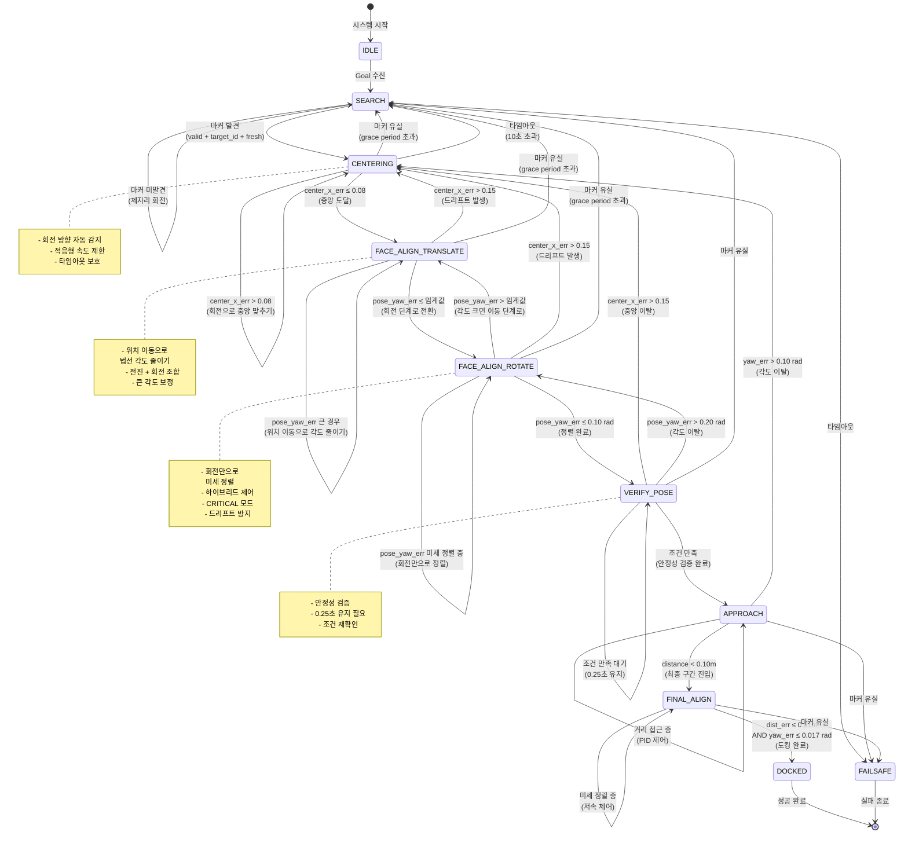

# Pinky Precision Docking System
## 정밀 도킹/파킹 시스템 개발 발표 자료

---

## 0. 개괄적인 설명

### 0.1 프로젝트 목표

**Pinky Precision Docking**은 ROS2 기반의 정밀 도킹/파킹 시스템으로, 시각 마커(ArUco/AprilTag)를 활용하여 로봇이 정확한 위치와 자세로 도킹 스테이션에 접근하고 도킹하는 것을 목표로 합니다.

**핵심 목표:**
- **정밀도**: 최종 위치 오차 1cm 이내, 각도 오차 1도 이내
- **안정성**: 마커 일시적 유실에도 안정적인 제어 유지
- **자동화**: 완전 자동 도킹 프로세스 구현

### 0.2 개발 진행 상황

**현재 구현 완료:**
- ✅ ROS2 Action Server 기반 FSM 구현
- ✅ 다단계 정렬 프로세스 (CENTERING → FACE_ALIGN → VERIFY_POSE)
- ✅ PID 제어기 기반 정밀 제어
- ✅ 마커 유실 처리 및 Grace Period 구현
- ✅ 회전 방향 자동 감지 및 보정 메커니즘
- ✅ 하이브리드 제어 (pose_yaw_err + center_x_err 동시 제어)

**진행 중:**
- 🔄 FACE_ALIGN 상태에서 center_x_err 드리프트 문제 해결
- 🔄 CRITICAL 모드 최적화

**향후 구현 예정:**
- 📋 FACE_ALIGN을 두 단계로 분리 (이동 후 정면 방향 전환 방식)
  - `FACE_ALIGN_TRANSLATE`: 위치 이동으로 법선 각도 줄이기
  - `FACE_ALIGN_ROTATE`: 회전만으로 법선 미세 정렬

### 0.3 ROS2 패키지 구조

**패키지명:** `pinky_precision_docking`

**주요 노드 및 역할:**

| 노드/컴포넌트 | 역할 | 특징 |
|------------|------|------|
| **PrecisionDockingServer** | 메인 Action Server | FSM 실행, 제어 명령 생성 |
| **Marker2D Subscriber** | 마커 정보 수신 | `/precision/marker2d` 구독, 마커 위치/각도 정보 수집 |
| **Twist Publisher** | 속도 명령 발행 | `/cmd_vel_raw`로 제어 명령 전송 |
| **Dock Action Server** | 도킹 요청 처리 | `/precision/dock` 액션 서버, Goal/Feedback/Result 처리 |
| **PID Controllers** | 제어 알고리즘 | 5개의 독립 PID 제어기 (yaw, dist, center, pose, dist_final) |
| **FSM State Machine** | 상태 관리 | 10개 상태 전이 관리 및 로직 실행<br/>(향후 FACE_ALIGN 분리 시 11개) |

**주요 토픽/액션:**
- **구독:** `/precision/marker2d` (Marker2D)
- **발행:** `/cmd_vel_raw` (Twist)
- **액션:** `/precision/dock` (Dock.action)

---

## 1. State Machine 다이어그램 및 상태 설명

### 1.1 FSM 다이어그램



### 1.2 상태별 상세 설명

#### **IDLE (대기 상태)**
- **역할**: 시스템 초기화 및 대기
- **특징**: Goal 요청 대기 중
- **전이 조건**: Goal 수신 시 → SEARCH

#### **SEARCH (탐색 상태)**
- **역할**: 마커를 찾기 위한 제자리 회전
- **제어**: `w_cmd = 0.25 rad/s` (고정 각속도)
- **전이 조건**:
  - ✅ 마커 발견 (valid + target_id + fresh) → CENTERING
  - ❌ 타임아웃 → FAILSAFE

#### **CENTERING (중앙 정렬 상태)**
- **역할**: 마커를 카메라 화면 중앙에 위치시키기
- **제어 변수**: `center_x_err` (정규화 -1~+1)
- **제어 방식**: PID 제어로 회전만 수행 (`v_cmd = 0.0`)
- **특징**:
  - 회전 방향 자동 감지 및 보정
  - 적응형 속도 제한 (큰 오차 시 더 빠른 회전)
  - 타임아웃 보호 (10초)
- **전이 조건**:
  - ✅ `abs(center_x_err) ≤ 0.08` → FACE_ALIGN_TRANSLATE
  - ❌ 마커 유실 (grace 0.3초 초과) → SEARCH
  - ❌ 타임아웃 (10초) → SEARCH

#### **FACE_ALIGN_TRANSLATE (법선 정렬 - 이동 단계)** ⭐ [향후 구현 예정]
- **역할**: 위치 이동을 통해 마커 법선 각도를 크게 줄이기
- **제어 변수**: 
  - `pose_yaw_err` (주 제어)
  - `center_x_err` (보조 제어, 드리프트 방지)
- **제어 방식**: 전진 + 회전 조합 제어
  - 큰 `pose_yaw_err` (예: > 1.0 rad) 상황에서 사용
  - 전진을 통해 마커와의 상대 위치를 조정하여 각도 개선
  - 회전과 전진을 동시에 수행
- **특징**:
  - 회전만으로는 해결하기 어려운 큰 각도 보정
  - 위치 이동으로 법선 각도를 효과적으로 감소
  - `center_x_err` 유지하면서 `pose_yaw_err` 감소
- **전이 조건**:
  - ✅ `abs(pose_yaw_err) ≤ 임계값` (예: 0.5 rad) → FACE_ALIGN_ROTATE
  - ❌ `abs(center_x_err) > 0.15` → CENTERING (드리프트)
  - ❌ 마커 유실 (grace 0.3초 초과) → SEARCH

#### **FACE_ALIGN_ROTATE (법선 정렬 - 회전 단계)**
- **역할**: 회전만으로 마커 법선을 카메라 정면으로 미세 정렬
- **제어 변수**: 
  - `pose_yaw_err` (주 제어)
  - `center_x_err` (보조 제어, 드리프트 방지)
- **제어 방식**: 하이브리드 제어 (가중 평균)
  - 일반 모드: `w_cmd = (1-α)×w_pose + α×w_center`
  - 우선 보정 모드: `center_x_err > 0.10` 시 가중치 증가
  - CRITICAL 모드: `center_x_err > 0.12` 시 `center_x_err`만 제어
- **특징**:
  - `pose_yaw_err`가 클 때 속도 제한 증가
  - `center_x_err` 드리프트 사전 방지
  - 조건부 전진 허용 (`pose_yaw_err < 0.20` 시 `v_cmd = 0.01 m/s`)
- **전이 조건**:
  - ✅ `abs(pose_yaw_err) ≤ 0.10 rad` → VERIFY_POSE
  - ❌ `abs(pose_yaw_err) > 임계값` (예: 0.5 rad) → FACE_ALIGN_TRANSLATE
  - ❌ `abs(center_x_err) > 0.15` → CENTERING (드리프트)
  - ❌ 마커 유실 (grace 0.3초 초과) → SEARCH

> **참고**: 현재 구현에서는 `FACE_ALIGN` 하나로 통합되어 있으나, 향후 `FACE_ALIGN_TRANSLATE`와 `FACE_ALIGN_ROTATE`로 분리하여 더 정밀한 제어를 구현할 예정입니다.

#### **VERIFY_POSE (자세 검증 상태)**
- **역할**: 정렬 상태가 안정적으로 유지되는지 검증
- **제어**: 정지 (`v_cmd = 0.0`, `w_cmd = 0.0`)
- **검증 조건**:
  - `abs(center_x_err) ≤ 0.15`
  - `abs(pose_yaw_err) ≤ 0.20 rad`
  - **0.25초 동안 연속 만족** 필요
- **전이 조건**:
  - ✅ 조건 0.25초 유지 → APPROACH
  - ❌ `abs(center_x_err) > 0.15` → CENTERING
  - ❌ `abs(pose_yaw_err) > 0.20 rad` → FACE_ALIGN
  - ❌ 마커 유실 → SEARCH

#### **APPROACH (접근 상태)**
- **역할**: 목표 거리까지 접근
- **제어 변수**: `distance_m`, `yaw_rad`
- **제어 방식**: PID 제어 (거리 + 각도 동시 제어)
- **특징**: 전진만 허용 (`v_cmd ≥ 0.0`)
- **전이 조건**:
  - ✅ `distance < 0.10m` → FINAL_ALIGN
  - ❌ `abs(yaw_err) > 0.10 rad` → CENTERING
  - ❌ 마커 유실 → FAILSAFE

#### **FINAL_ALIGN (최종 정렬 상태)**
- **역할**: 최종 미세 정렬 및 도킹 완료
- **제어 변수**: `distance_m`, `yaw_rad`
- **제어 방식**: 저속 PID 제어 (`max_v = 0.02 m/s`, `max_w = 0.3 rad/s`)
- **특징**: 후진 도킹 지원 (`reverse=True` 시 `v_cmd < 0`)
- **완료 조건**:
  - `abs(dist_err) ≤ 0.01m` **AND** `abs(yaw_err) ≤ 0.017 rad` (1도)
- **전이 조건**:
  - ✅ 완료 조건 만족 → DOCKED
  - ❌ 마커 유실 → FAILSAFE

#### **DOCKED (도킹 완료 상태)**
- **역할**: 도킹 성공 처리
- **동작**: 정지 및 Action Success 반환
- **결과**: 최종 위치/각도 오차 기록

#### **FAILSAFE (안전 모드)**
- **역할**: 예외 상황 처리
- **발생 조건**:
  - 타임아웃
  - APPROACH/FINAL_ALIGN 중 마커 유실
  - 기타 치명적 오류
- **동작**: 정지 및 Action Abort 반환

---

## 2. 현재 겪고 있는 문제와 해결 방안

### 2.1 주요 문제점

#### **문제 1: FACE_ALIGN 상태에서 center_x_err 드리프트**

**증상:**
- CENTERING에서 FACE_ALIGN로 성공적으로 전이
- FACE_ALIGN 상태에서 `pose_yaw_err` 제어 중 `center_x_err`가 점진적으로 증가
- `center_x_err`가 `center_enter_th (0.15)`를 초과하여 CENTERING으로 복귀
- 이로 인한 **CENTERING ↔ FACE_ALIGN 무한 루프**

**원인 분석:**
1. `pose_yaw_err`가 매우 큼 (2.5~2.7 rad ≈ 143~155도)
2. PID 출력이 포화 (`raw_w_pose ≈ 3.0~3.3`)
3. `w_cmd`가 `max_w_face (0.15)`로 제한되어 `center_x_err` 보정 효과 부족
4. `pose_yaw_err` 제어가 `center_x_err`를 간접적으로 악화
5. **회전만으로는 큰 각도를 효과적으로 보정하기 어려움**

#### **문제 3: 큰 pose_yaw_err 상황에서의 제어 한계** ⭐ [새로운 문제 인식]

**증상:**
- 마커가 비스듬한 각도로 인식될 때 (예: 90도 이상)
- 회전만으로는 법선 각도를 효과적으로 줄이기 어려움
- 제자리 회전만으로는 마커와의 상대 위치가 변하지 않아 각도 개선이 제한적

**원인 분석:**
- 차동 구동 로봇의 특성상 제자리 회전만으로는 마커와의 상대 위치 변경이 어려움
- 큰 각도에서는 위치 이동이 필요한데, 현재는 회전 위주 제어만 수행

#### **문제 2: 회전 방향 불일치**

**증상:**
- CENTERING과 FACE_ALIGN에서 회전 방향 로직 불일치
- CRITICAL 모드에서도 `center_x_err`가 계속 증가

**원인 분석:**
- PID 출력 부호 처리 로직이 상태별로 다름
- `raw_w_center` 부호 반전 적용이 일관되지 않음

### 2.2 해결 방안

#### **해결 방안 0: FACE_ALIGN을 두 단계로 분리** ⭐ [근본적 해결 방안]

**구현 계획:**

1. **FACE_ALIGN_TRANSLATE (이동 단계)**
   - **목적**: 위치 이동을 통해 큰 `pose_yaw_err`를 효과적으로 감소
   - **제어 방식**: 
     - 전진 + 회전 조합 제어
     - `pose_yaw_err`가 큰 경우 (예: > 1.0 rad) 전진을 통해 마커와의 상대 위치 조정
     - `v_cmd`와 `w_cmd`를 동시에 제어하여 위치와 각도 동시 개선
   - **전이 조건**:
     - `abs(pose_yaw_err) ≤ 임계값` (예: 0.5 rad) → FACE_ALIGN_ROTATE
     - `abs(pose_yaw_err) > 임계값`이면 계속 TRANSLATE 유지
   - **장점**:
     - 회전만으로는 해결하기 어려운 큰 각도를 효과적으로 보정
     - 마커와의 상대 위치 변경으로 각도 개선 가능

2. **FACE_ALIGN_ROTATE (회전 단계)**
   - **목적**: 회전만으로 미세한 `pose_yaw_err` 정렬
   - **제어 방식**: 
     - 기존 FACE_ALIGN 로직을 이 상태로 이전
     - 하이브리드 제어 (pose_yaw_err + center_x_err)
     - 우선 보정 모드 및 CRITICAL 모드 유지
   - **전이 조건**:
     - `abs(pose_yaw_err) ≤ 0.10 rad` → VERIFY_POSE
     - `abs(pose_yaw_err) > 임계값` (예: 0.5 rad) → FACE_ALIGN_TRANSLATE
   - **장점**:
     - 작은 각도에서는 회전만으로도 정밀한 정렬 가능
     - 위치 이동 없이 안정적인 제어

**구현 전략:**
- **1단계**: FACE_ALIGN_ROTATE 구현 (기존 FACE_ALIGN 로직 이전)
- **2단계**: FACE_ALIGN_TRANSLATE 구현 (새로운 이동 제어 로직)
- **3단계**: 두 상태 간 전이 조건 및 로직 구현
- **4단계**: 파라미터 튜닝 및 최적화

#### **해결 방안 1: 하이브리드 제어 및 우선순위 모드** (현재 구현)

**구현 내용:**

1. **하이브리드 제어**
   ```python
   w_cmd = (1 - center_weight) × raw_w_pose + center_weight × raw_w_center
   ```
   - `center_weight`: `center_x_err` 크기에 따라 0.0~0.5로 동적 조정
   - 작은 오차일 때도 미세 보정 (최대 0.1 가중치)

2. **우선 보정 모드** (`center_x_err > 0.10`)
   - `center_weight` 증가 (0.5~0.9)
   - 속도 제한 증가 (`max_w = 0.30`)

3. **CRITICAL 모드** (`center_x_err > 0.12`)
   - `pose_yaw_err` 제어 완전 중단
   - `center_x_err`만 100% 제어
   - 속도 제한 증가 (`max_w = 0.30`)

4. **Large pose_err 모드** (`pose_yaw_err > 2.0 rad`)
   - 속도 제한 증가 (`max_w = 0.225`)
   - `center_x_err` 보정 가중치 증가

#### **해결 방안 2: 회전 방향 통일**

**구현 내용:**

1. **CENTERING과 FACE_ALIGN 동일 로직**
   ```python
   if not self.centering_direction_reversed:
       raw_w_center = -raw_w_center  # 기본 반전
   # centering_direction_reversed=True일 때는 원래 방향 사용
   ```

2. **CRITICAL 모드 부호 처리**
   ```python
   w_cmd = clamp(-raw_w_center, -max_w, max_w)  # 한 번 더 반전
   ```

3. **회전 방향 자동 감지**
   - `center_x_err` 변화 추적
   - 3회 연속 악화 시 방향 반전
   - PID 리셋 및 방향 플래그 토글

#### **해결 방안 3: 적응형 속도 제한**

**구현 내용:**

1. **CENTERING**: 
   - 기본: `max_w = 0.30`
   - 큰 오차 (`> 0.5`): `max_w = 0.40`

2. **FACE_ALIGN**:
   - 기본: `max_w = 0.15`
   - 우선 보정 모드: `max_w = 0.30`
   - Large pose_err 모드: `max_w = 0.225`

#### **해결 방안 4: Grace Period 및 타임아웃**

**구현 내용:**

1. **Grace Period** (0.3초)
   - CENTERING/FACE_ALIGN에서 마커 일시적 유실 허용
   - 즉시 SEARCH로 전이하지 않음

2. **CENTERING 타임아웃** (10초)
   - 무한 루프 방지
   - 타임아웃 시 SEARCH로 복귀

### 2.3 개선 효과

**현재 구현된 개선 사항:**

1. ✅ `center_x_err` 드리프트 사전 방지
2. ✅ CENTERING ↔ FACE_ALIGN 무한 루프 감소
3. ✅ 회전 방향 일관성 확보
4. ✅ 큰 `pose_yaw_err` 상황에서도 안정적 제어 (제한적)
5. ✅ CRITICAL 모드에서 빠른 `center_x_err` 보정

**FACE_ALIGN 분리 후 예상 개선 사항:**

1. ✅ 큰 `pose_yaw_err` 상황에서 효과적인 각도 보정
2. ✅ 위치 이동을 통한 법선 각도 개선
3. ✅ TRANSLATE/ROTATE 단계별 최적화로 정밀도 향상
4. ✅ 회전만으로는 해결하기 어려운 상황 해결
5. ✅ 상태별 명확한 역할 분리로 디버깅 용이

**모니터링 포인트:**

- `center_weight`: 보정 가중치 (0.0~1.0)
- `center_x_err` 변화 추이
- 상태 전이 빈도
- CRITICAL 모드 활성화 빈도
- **TRANSLATE/ROTATE 전이 빈도** (향후)
- **pose_yaw_err 감소율** (향후)

---

## 3. 기술 스택 및 아키텍처

### 3.1 기술 스택

- **프레임워크**: ROS2 (Humble)
- **언어**: Python 3
- **제어 알고리즘**: PID (Proportional-Integral-Derivative)
- **상태 관리**: Finite State Machine (FSM)
- **마커 인식**: ArUco/AprilTag (외부 노드에서 처리)

### 3.2 아키텍처

```
┌─────────────────────────────────────────────────────────┐
│              Precision Docking System                   │
├─────────────────────────────────────────────────────────┤
│                                                         │
│  ┌──────────────┐         ┌──────────────┐            │
│  │ Marker2D     │─────────▶│ Action       │            │
│  │ Subscriber  │          │ Server       │            │
│  └──────────────┘         └──────────────┘            │
│         │                        │                      │
│         │                        │                      │
│         ▼                        ▼                      │
│  ┌──────────────┐         ┌──────────────┐            │
│  │ FSM State    │─────────▶│ PID          │            │
│  │ Machine      │          │ Controllers  │            │
│  └──────────────┘         └──────────────┘            │
│         │                        │                      │
│         │                        │                      │
│         └──────────┬─────────────┘                      │
│                    ▼                                     │
│         ┌──────────────┐                                │
│         │ Twist        │                                │
│         │ Publisher    │                                │
│         └──────────────┘                                │
│                                                         │
└─────────────────────────────────────────────────────────┘
```

### 3.3 PID 제어기 구성

| PID 제어기 | 제어 변수 | 용도 | Gains (kp, ki, kd) |
|-----------|---------|------|-------------------|
| `pid_yaw` | `yaw_rad` | 일반 각도 제어 | (1.6, 0.0, 0.10) |
| `pid_dist` | `distance_m` | 접근 거리 제어 | (0.8, 0.0, 0.0) |
| `pid_dist_final` | `distance_m` | 최종 거리 제어 | (0.6, 0.0, 0.0) |
| `pid_center` | `center_x_err` | 화면 중앙 제어 | (1.2, 0.0, 0.0) |
| `pid_pose` | `pose_yaw_err` | 법선 각도 제어 | (1.2, 0.0, 0.08) |

> **참고**: 향후 `FACE_ALIGN_TRANSLATE` 구현 시 추가 PID 제어기나 제어 로직이 필요할 수 있습니다.

---

## 4. 향후 개발 계획

### 4.1 단기 계획

1. **FACE_ALIGN 분리 구현** ⭐ [우선순위]
   - `FACE_ALIGN_TRANSLATE` 상태 구현
     - 위치 이동으로 큰 `pose_yaw_err` 보정
     - 전진 + 회전 조합 제어 로직
   - `FACE_ALIGN_ROTATE` 상태 구현
     - 회전만으로 미세 정렬
     - 기존 FACE_ALIGN 로직을 이 상태로 이전
   - 두 상태 간 전이 조건 및 로직 구현

2. **FACE_ALIGN 최적화**
   - 하이브리드 제어 파라미터 튜닝
   - CRITICAL 모드 임계값 조정
   - TRANSLATE/ROTATE 단계별 최적화

3. **로봇 테스트**
   - 실제 환경에서 FSM 동작 검증
   - 다양한 초기 조건 테스트
   - TRANSLATE/ROTATE 분리 효과 검증

### 4.2 중기 계획

1. **성능 개선**
   - 동적 파라미터 조정
   - 학습 기반 제어 (선택)

2. **안정성 강화**
   - 추가 예외 처리
   - 복구 메커니즘 개선

### 4.3 장기 계획

1. **기능 확장**
   - 다중 마커 지원
   - 동적 장애물 회피

2. **최적화**
   - 계산 효율성 개선
   - 실시간 성능 향상

---

## 5. 참고 자료

### 5.1 주요 파일

- `docking_action_server.py`: 메인 FSM 로직
- `fsm.py`: 상태 정의
- `pid.py`: PID 제어기 구현

### 5.2 주요 파라미터

| 파라미터 | 값 | 설명 |
|---------|-----|------|
| `center_exit_th` | 0.08 | CENTERING 종료 임계값 |
| `center_enter_th` | 0.15 | CENTERING 재진입 임계값 |
| `pose_exit_th` | 0.10 rad | FACE_ALIGN 종료 임계값 |
| `pose_enter_th` | 0.20 rad | FACE_ALIGN 재진입 임계값 |
| `verify_hold_sec` | 0.25 s | VERIFY_POSE 유지 시간 |
| `align_loss_grace` | 0.30 s | 마커 유실 Grace Period |
| `centering_timeout_sec` | 10.0 s | CENTERING 타임아웃 |

---

**작성일**: 2024년  
**버전**: 1.0  
**작성자**: Pinky Precision Docking Team

